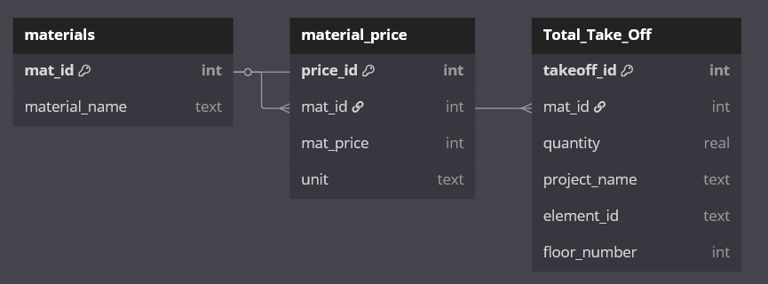

# Design Document

Piotr Dziembowski

Video overview: <[URL HERE](https://youtu.be/2xxR7fyiA0g)>

## Scope

* The purpose of this database is to track construction materials used across different building projects. It allows users to store material types, unit prices, quantities used in specific locations (like floors or elements), and automatically calculate total material costs. It supports quantity take-offs, budgeting, and reporting in a structured and scalable way.

Includes:
* Materials (e.g., concrete, steel, insulation, drywall)

* Material prices and units (e.g., 450 zł/m³ for concrete)

* Project elements (e.g., walls, beams, floors)

* Quantities and usage of materials per element and floor

* Projects or buildings (tracked by name or description)

* Cost calculations per item based on quantity × unit price

## Functional Requirements

* A user should be able to use this database to manage and analyze construction material usage across multiple building projects. They can add and view materials along with their unit prices and measurement units, such as zł per cubic meter or zł per square meter. The user can also record how much of each material is used for specific building elements, on specific floors, and within specific projects. Based on these entries, the database automatically calculates the total cost for each material instance using the quantity and unit price. The user can access predefined views to easily read this information, including readable formats of unit prices and full cost breakdowns per material. Additionally, the structure supports filtering and analyzing data by floor or project, enabling the user to perform take-off analysis, budgeting, and material cost tracking efficiently. Indexing ensures that queries remain fast and responsive even as the dataset grows.

## Representation

### Entities

* In my database, I chose to represent three core entities: materials, material prices, and take-offs (material quantities used in construction). The materials entity includes attributes such as mat_id (a unique identifier) and material_name (e.g., Beton C30/37 or Styropian EPS100). The material_price entity stores the unit price for each material and includes attributes like price_id, mat_id (as a foreign key referencing materials), mat_price (an integer representing the cost), and unit (e.g., m³, kg, m²). Finally, the Total_Take_Off entity tracks how much of each material is used per building element and includes takeoff_id, mat_id, quantity, project_name, element_id, and floor_number.

### Relationships

## Optimizations

* I created indexes on the mat_id columns in material_price and Total_Take_Off to speed up joins and lookups. I also created two views: one to calculate total material costs and another to display material names with formatted prices. These optimizations improve performance and make querying easier.

## Limitations

* No limitations

